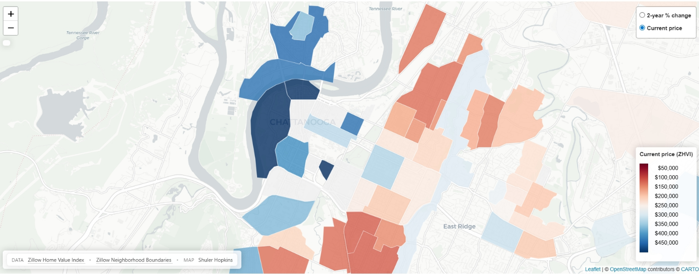

::: {.project-page}

::: {.project-kicker}
Project
:::

::: {.project-subtitle}
An interactive R Shiny app for exploring home values and recent price changes across neighborhoods in a given city. Follow this link to try the app yourself: [Neighborhood Housing Trends](https://vkmw3f-shuler-hopkins.shinyapps.io/tn-housing-trends/){target="_blank" rel="noopener noreferrer"}
:::

::: {.project-hero}

:::

::: {.project-meta}
::: {.project-meta-card}
### Type
Interactive mapping application
:::

::: {.project-meta-card}
### Tools
R, Shiny, Leaflet, sf, dplyr
:::

::: {.project-meta-card}
### Focus
Housing trends by neighborhood, presented in an interactive interface
:::
:::

## Overview { .project-section }

This project grew out of an interest in making housing data easier to explore at a local level. Housing discussions often jump quickly to state or national averages, but those summaries can hide the fact that nearby places may be moving in very different ways. I wanted to build something more grounded: a tool that lets a user explore how prices and growth vary across neighborhoods in a given city.

The result is an interactive application built in R with Shiny. It combines housing data with geographic boundaries and presents the results through a map-based interface, so the user can see neighborhood level housing trends.

::: {.project-pullquote}
The aim was not just to display data, but to make neighborhood variation easier to notice and easier to interpret.
:::

## Why this project is useful { .project-section }

In practical terms, this is most useful for people trying to understand a city at a neighborhood level. Someone considering a move can quickly compare affordability and recent price trends across areas, while someone working in housing or development can use it as a fast way to scan for local differences worth investigating further.

The aim is not to answer every question, but to make the first pass through the data easier and more informative.

## What I built { .project-section }

- An interactive map interface for exploring housing trends at a neighborhood level
- Views centered on home values and recent change over time
- A structure that combines geographic boundaries with housing data in a way that supports quick and easy comparison

I was especially interested in building a project that moved beyond a static chart. The map interface makes it possible to scan for broad patterns first and then narrow in on places that look unusual or worth investigating further.

## Data and tools { .project-section }

The repository uses Zillow Home Value Index data and Census boundary data, and the codebase is written entirely in R. The repository includes an `app.R` file for the Shiny application along with supporting data and scripts, and the current README describes the project as an analysis of neighborhood housing trends.

From a tooling perspective, this project sits in a space I like a great deal: lightweight analytical tools that are technically serious but still readable. The emphasis was on using R not just for analysis, but also for presentation.

## What I learned { .project-section }

This project reinforced a lesson that comes up often in quantitative work: once the core analysis is in place, the next challenge is usually one of structure. What should be compared? What deserves visual emphasis? What makes a user trust what they are seeing?

It also reminded me that interactive projects benefit from restraint. A useful map does not need ten controls or a complicated story. It needs a few meaningful comparisons, a clear visual hierarchy, and enough context for the user to stay oriented.

## Links { .project-section }

::: {.project-links}
[Neighborhood Housing App](https://vkmw3f-shuler-hopkins.shinyapps.io/tn-housing-trends/){.btn-primary target="_blank" rel="noopener noreferrer"}
[GitHub repository](https://github.com/shuler7/tn-housing-trends){.btn-primary target="_blank" rel="noopener noreferrer"}
[Back to projects](projects.qmd){.btn-secondary}
:::

[Return to the homepage](index.qmd){.back-link}

:::